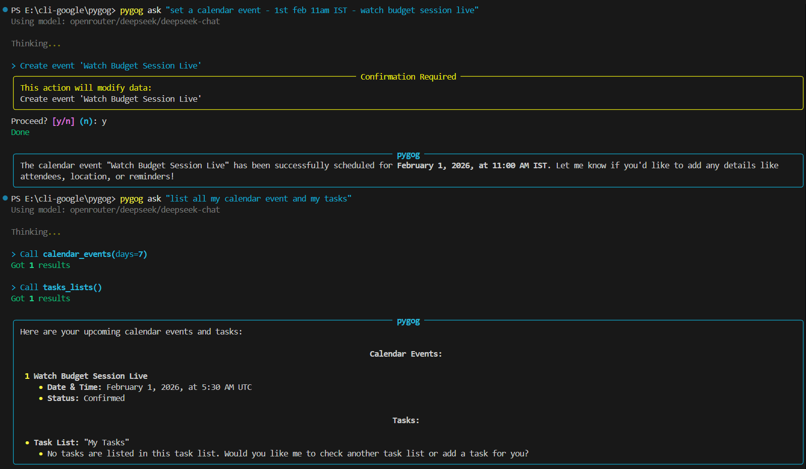
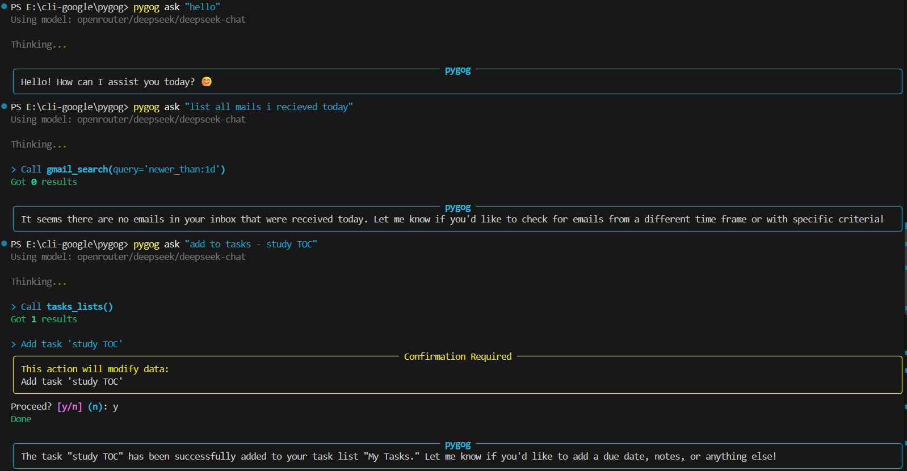
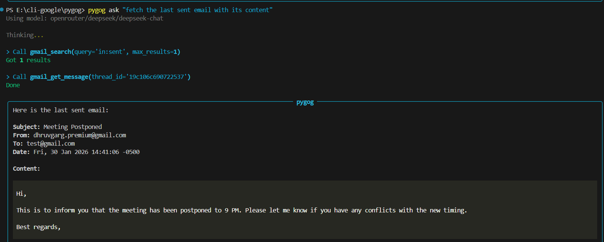

<div align="center">

# 🧭 pygog

### **Google in Your Terminal — Done Right.**

[](https://python.org)
[](LICENSE)
[](https://gmail.com)
[](https://drive.google.com)
[](https://calendar.google.com)

---

**A fast, powerful, and script-friendly CLI for Google services.**  
*Built with Python for performance and reliability.*

[Features](#-features) • [Installation](#-installation) • [Quick Start](#-quick-start) • [Commands](#-command-reference) • [Agent](#-natural-language-agent)

</div>

---

## ✨ Features

<table>
<tr>
<td width="50%">

### 📧 Gmail
- Search threads with advanced queries
- Send emails with HTML support
- Manage labels and drafts
- Read and organize your inbox

</td>
<td width="50%">

### 📂 Google Drive
- List and search files
- Upload and download with ease
- Auto-export Google Docs to PDF/DOCX
- Navigate folders seamlessly

</td>
</tr>
<tr>
<td width="50%">

### 🗓️ Calendar
- View and manage events
- Check free/busy status
- RSVP to invitations
- Quick event creation

</td>
<td width="50%">

### ✅ Tasks
- Full task list management
- Create, update, and complete tasks
- Organize with multiple lists
- Due date support

</td>
</tr>
</table>

### 🎯 Power Features

| Feature | Description |
|---------|-------------|
| 🤖 **Natural Language Agent** | Ask in plain English — supports DeepSeek, OpenAI, Gemini & Anthropic |
| 🌐 **Web Search** | Real-time access to news, prices, and weather |
| 🔑 **Secure Storage** | OS-level keyring for sensitive tokens |
| 💻 **JSON Output** | Perfect for automation and scripting |
| 👥 **Multi-Account** | Manage multiple Google accounts with aliases |

---

## 🚀 Installation

```bash
# Clone the repository
git clone https://github.com/pygog/pygog.git
cd pygog

# Install in editable mode
pip install -e .
```

> **Note:** Requires Python 3.10 or higher.

---

## 🛠️ Quick Start

### Step 1: Create Google Cloud Credentials

1. Go to the [Google Cloud Console](https://console.cloud.google.com/apis/credentials)
2. Create a new project
3. Enable the **Gmail**, **Drive**, **Calendar**, and **Tasks** APIs
4. Create an **OAuth Client ID** (Desktop App)
5. Download the credentials JSON file

### Step 2: Register Your Credentials

```bash
pygog auth credentials path/to/credentials.json
```

### Step 3: Authenticate Your Account

```bash
# Opens browser for secure OAuth flow
pygog auth add your.email@gmail.com --services gmail,drive,calendar,tasks
```

✅ **You're ready to go!**

---

## 🤖 Natural Language Agent

The killer feature of `pygog` — talk to your Google Workspace in plain English.

### Quick Setup

Set your preferred LLM API key:

```bash
# Choose one (PowerShell)
$env:DEEPSEEK_API_KEY = "sk-..."
$env:OPENAI_API_KEY = "sk-..."
$env:GEMINI_API_KEY = "AIza..."
$env:ANTHROPIC_API_KEY = "sk-ant..."
$env:OPENROUTER_API_KEY = "sk-or..."
```

### See It In Action

<div align="center">

#### 📅 Calendar & Tasks Management
*"Set a calendar event" • "List all my calendar events and tasks"*



---

#### 📧 Gmail & Task Creation
*"Hello" • "List all emails received today" • "Add to tasks"*



---

#### 📨 Email Retrieval
*"Fetch the last sent email with its content"*



</div>

### More Examples

```bash
# Email & Drive
pygog ask "Find the Q4 report PDF and email it to my boss"
pygog ask "What unread emails do I have?"

# Calendar & Tasks
pygog ask "What meetings do I have this week?"
pygog ask "Remind me to call John tomorrow at 2pm"

# Web Search
pygog ask "What is the gold price in Delhi today?"
pygog ask "Latest tech news"

# Specify model (optional)
pygog ask "Summarize my emails" --model gpt-4o
```

---

## 📖 Command Reference

### 📧 Gmail

```bash
# Search for recent emails
pygog gmail search "from:boss newer_than:1d" --max 5

# Send an email
pygog gmail send --to "friend@example.com" --subject "Hello" --body "Sent from pygog!"

# List your labels
pygog gmail labels list
```

### 📂 Google Drive

```bash
# List files in root directory
pygog drive ls --max 10

# Download and export as PDF
pygog drive download <FILE_ID> --format pdf --out report.pdf

# Upload a file
pygog drive upload ./backup.zip --name "Weekly Backup"
```

### 🗓️ Calendar

```bash
# View today's events
pygog calendar events --today

# Create a new event
pygog calendar create --summary "Team Meeting" --from "2026-02-01T10:00:00" --to "2026-02-01T11:00:00"

# Check availability
pygog calendar freebusy --calendars "user1@org.com,user2@org.com" --from "today" --to "tomorrow"
```

### ✅ Tasks

```bash
# List all task lists
pygog tasks lists

# View tasks in a list
pygog tasks list <TASKLIST_ID>

# Add a new task
pygog tasks add <TASKLIST_ID> --title "Review PR" --due "tomorrow"
```

---

## ⚙️ Advanced Configuration

### 🏷️ Account Aliases

Stop typing long email addresses:

```bash
# Set an alias
pygog auth alias set work "primary.work.account@company.com"

# Use it anywhere
pygog --account work gmail search "urgent"
```

### 🎯 Default Account

```bash
pygog config set default_account your.email@gmail.com
```

### 📤 Output Formats

| Format | Flag | Use Case |
|--------|------|----------|
| **Table** | *(default)* | Human-readable terminal output |
| **JSON** | `--json` | Scripting with `jq` |
| **Plain** | `--plain` | TSV-style for grep/awk |

```bash
# Example: Get first file ID from Drive
pygog --json drive ls | jq '.[0].id'
```

---

## 🔒 Security

Your security is our priority:

- 🔐 **Keyring Integration** — OAuth tokens stored in OS-level secure storage
  - macOS: Keychain
  - Windows: Credential Manager  
  - Linux: Secret Service
- 🚫 **No Plaintext** — Tokens are never stored in plaintext files
- ✅ **OAuth 2.0** — Industry-standard secure authentication

---

## 🛣️ Roadmap

- [ ] Google Meet integration
- [ ] Contacts support
- [ ] Keep notes management
- [ ] Interactive TUI mode
- [ ] Vim-style keybindings

---

## 🤝 Contributing

Contributions are welcome! Feel free to:

1. Fork the repository
2. Create a feature branch
3. Submit a pull request

---

## 📜 License

This project is licensed under the **MIT License** — see the [LICENSE](LICENSE) file for details.

---

<div align="center">

### 🎨 Built With

[](https://python.org)
[](https://typer.tiangolo.com)
[](https://rich.readthedocs.io)
[](https://developers.google.com)

---

**Made with ❤️ and assistance from Claude Opus 4.5**

*I wanted to explore its capabilities — and it delivered!*

</div>
